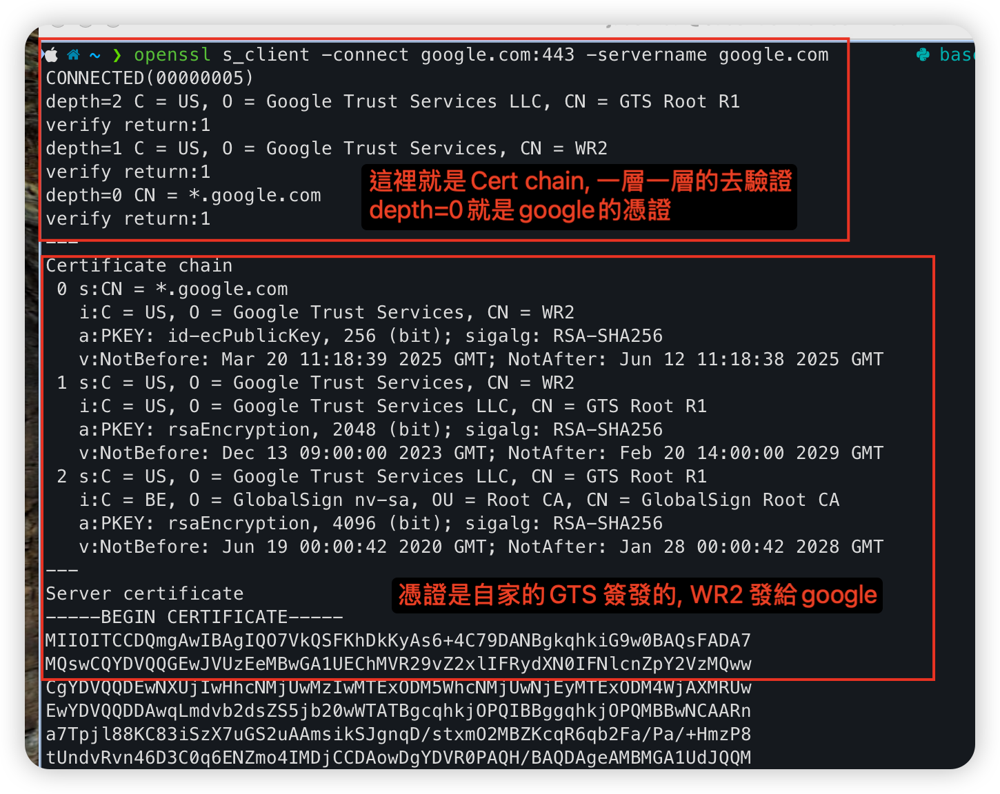

上一篇聊到了 TCP/UDP, 和非對稱加密/對稱加密的基本觀念, 再來繼續聊建立建立通訊之後之後的事!!
這也是我在準備AWS Cloud Support Engineer面試題, 重新整理思路釐清整體概念的, 我們先從網路層面說起

--- 

## 輸入網址之後發生的事
有沒有想過, 在使用Browser輸入`google.com`按下 Enter, 之後發生了什麼事? 瀏覽器是怎麼將網頁顯示在你的螢幕上的!

按下Enter之後, 首先會先去DNS server(一般是UDP 53port, 但會先查看本機的cache) 查詢到google.com 的IP是多少.

這裡我們使用dig指令 來查看DNS server 的資訊(另外也可以使用nslookup來查詢, 但是現在新的工具建議使用dig比較清楚)

- status: NOERROR 代表沒有錯誤
- QUESTION SECTION 我們查詢的是google的A記錄
- Google.com 對應的 IP是 142.250.196.206

### HTTPS 與 TLS
當瀏覽器拿到 IP 後, 這時候看到網址是「https://」開頭就其實背後就是使用SSL/TLS加密,會觸發 TLS Handshake, 這時候SSL/TLS做了2件事, 
1. 使用加密可以確保傳輸的內容不會被竊聽
2. 驗證伺服器身分（確認你連的是真的 Google，而不是假網站）

### TLS Handshake的流程
當連到 https:// 開頭的網站時，背後其實跑的流程：
1. Client 發送 Hello 告訴Server 我支援哪些加密演算法, TLS 版本?
2. Server 回傳 Hello 跟Certificate（網站名稱, 憑證, 公鑰）
3. 瀏覽器會檢查憑證是否有效 (有沒有過期, 是不是有效的CA發的, 主機名)
4. 如果沒問題, 瀏覽器用公鑰加密Session Key送給 Server
5. Server 用私鑰解開 Session Key，之後用這把金鑰雙方加密傳輸

為什麼安全呢?
- 公鑰加密是「一把鎖 → 人人可鎖，只能你自己能解」的概念
- 就算中間有人攔截，也無法解出 Session Key

這也是上一篇說到的 混合加密（RSA + AES）。
> 非對稱加密建立信任 + 對稱加密負責傳輸 
> 因為對稱加密速度快，適合長時間大量傳輸，而非對稱加密雖安全但運算慢，適合只用在「傳送 session key」。

這裡使用openssl來查看 TLS 連線過程：
openssl s_client -connect google.com:443 -servername google.com -msg

- Client Hello → 支援哪些加密演算法、TLS 版本
- Server Hello → 協議、Cipher、憑證內容

這裡有一個重點是怎麼確定你連到的真的Google呢?怎麼去驗證呢?

## Certificate的運作

Certificate用來當作網頁的身份證, 上面寫了
- 網站名稱(google.com)
- 和上一篇說到的公鑰（用來給瀏覽器加密 Session Key, 單向的加密)
- 以及是誰背書的簽發者, (CA, Certificate Authority)? 這個清單上存在我們的瀏覽器中!
- 有效期限
- 簽章 CA 使用自己的key來加簽, 確定憑證沒有被篡改

有點像要進去公司大樓, 我拿員工證(Certificate)給管理員(Browser)看, 看到誰google發給我的員工證,這樣我就可以進去了（建立 HTTPS連線）.

瀏覽器內建會信任這些 CA 發的憑證, 所以我們的系統跟瀏覽器喔都有預設信任的CA清單, 都預設在系統當中了, 這幾個CA裡面的清單會自動更新來收錄新網站

- 所以瀏覽器信 CA → 信這張憑證 → 信這個網站。
- 只要是可信 CA 簽出來的憑證，瀏覽器就會信任
- CA 是憑證頒發單位

可以在瀏覽器中查看 Google 的憑證內容, 有效期限, 還有公鑰

這裡我來說一下憑證的簽發流程(self Signed常常會使用到, 以後在出一篇詳細說明)

一般的流程是這樣, 在server端 → 建立 CSR（憑證簽發請求） → 傳送給 CA → CA 用私鑰簽名 → 回傳憑證

用我最近找工作來舉例的話就是:我在104寫履歷（CSR），給我的推薦人（CA），幫我背書（簽名）說「Jason沒問題!」，我就可以拿著這張履歷（憑證）找工作（給瀏覽器驗證）。

## 總結
寫著寫著發現有太多要延伸出去的, 不知不覺寫了很多, 原本想要講 JWT 和自簽憑證，但還沒來得及, 下篇再繼續分享！