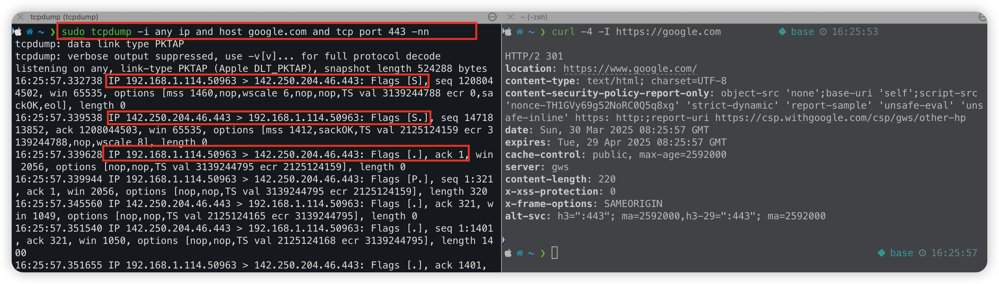

## 第二篇文章獻給 Andrew 和球魚啦!

工程師的聚會除了在罵 DGR、佛地魔之外，這次竟然從吃烤鴨聊到 x86、Apple II、DOS、macOS、iOS 的歷史，一路延伸到網景、Sun Microsystems。

然後被 Andrew 一個靈魂拷問直接問到：
> OSI 架構是什麼？TCP/IP 怎麼運作？什麼是 3-way handshake、UDP、JWT？

這些都是面試必考題，不過不理解整個演進脈絡，每次都會變成「一看就會、一被問就廢」。
就從TCP開始吧!!
---

## 故事起點：兩台機器要怎麼溝通？

### UDP：像寄明信片  
（想像一下哈利波特收到霍格華茲入學通知書）

完全沒有打招呼，資料就直接送出去，會導致：

- **不保證送達、順序也可能亂掉**
- 適合：直播、語音、遊戲（掉一封信沒差，反正大量資料一直傳）

**優點**：快、省資源  
**缺點**：不可靠，資料可能遺失

---

### TCP：像打電話

TCP 建立連線前會先「打招呼」 → **三次握手（3-way handshake）**

1. Client：嘿，我要跟你講話（SYN）
2. Server：好啊，我準備好了（SYN+ACK）
3. Client：那我開始說囉（ACK）

就像你打給朋友，對方說「喂」，你回「嗨」→ 連線才算建立。

**優點**：可靠、有順序、會補資料  
**缺點**：多一步手續，速度比 UDP 慢

---

## 用工具觀察握手流程

可以用 `tcpdump` 搭配 `curl` 觀察完整流程：

1. Client → Server：**SYN**  
   - 從本機（port 50963）發出 SYN 封包 → Google 443
2. Server → Client：**SYN-ACK**  
   - Google 回一個 SYN + ACK，acknowledge 你的序號
3. Client → Server：**ACK**  
   - 回 ACK，握手完成，連線建立

---

### 封包標記簡單對照表

| Flag | 意思 |
|------|------|
| `[S]`   | SYN：我要建立連線 |
| `[S.]`  | SYN+ACK：我也 OK，且回你 |
| `[.]`   | ACK：確認完成握手 |
| `[P.]`  | Push：開始傳資料 |
| `[F.]`  | FIN：我要斷線結束連線 |

---

## 資料會被偷怎麼辦？

建立溝通管道後，下一步要擔心資料被竊聽，這時就需要 **加密**。

就像電影裡的情報員，不能讓敵人偷聽到情報傳遞過程。

---

## 加密的兩種方式

### 對稱式加密（Symmetric Encryption）

情報員出發前，雙方先交換鑰匙：

- 情報員把資料放進保險箱，用鑰匙鎖起來送出
- 你收到後用一樣的鑰匙打開

**優點**：速度快，適合大量資料（影片、檔案）  
**缺點**：鑰匙交換很危險（傳輸過程被偷就破功）

---

### 非對稱式加密（Asymmetric Encryption – 公鑰與私鑰）

這種方式更聰明：

- 你有一把「鎖頭」🔓（公鑰）和一把「鑰匙」🔐（私鑰）
- 把鎖頭公開給情報員，情報員用它上鎖 → 資料安全寄回
- 只有你有的鑰匙能打開 → 不用交換私密資訊

**優點**：鑰匙不用傳，安全  
**缺點**：速度慢，不適合傳大量資料

---

## DevOps 世界中的加密應用

這兩種加密方式常搭配使用：

1. 用 **非對稱加密（RSA）** 傳送一組 session key  
2. 接著雙方用這組 session key 透過 **對稱加密（AES）** 傳輸大量資料

也就是做到：  
**安全交換鑰匙（RSA） + 高速傳輸資料（AES）**

---

今天就先寫到這，下一篇再來聊聊 Certificate、SSL/TLS、JWT 的原理與應用。